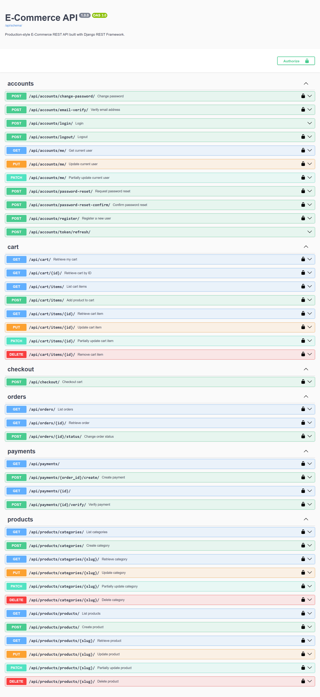

# E-Commerce API

A production-style Django REST Framework backend for an e-commerce platform, built to demonstrate professional API design, authentication, inventory-aware checkout, structured permissions, and deployment-ready Docker configuration.



## Table of Contents

- [Project Overview](#project-overview)
- [Purpose](#purpose)
- [Features](#features)
- [Tech Stack](#tech-stack)
- [Project Structure](#project-structure)
- [API Architecture](#api-architecture)
- [Authentication](#authentication)
- [API Endpoints](#api-endpoints)
- [Request and Response Examples](#request-and-response-examples)
- [Filtering, Searching, Ordering, and Pagination](#filtering-searching-ordering-and-pagination)
- [Rate Limiting / Throttling](#rate-limiting--throttling)
- [Redis](#redis)
- [Database](#database)
- [Docker](#docker)
- [Environment Variables](#environment-variables)
- [Local Development Without Docker](#local-development-without-docker)
- [Testing](#testing)
- [API Documentation](#api-documentation)
- [CI/CD](#cicd)
- [Security](#security)
- [Error Handling](#error-handling)
- [Database Setup / Migrations](#database-setup--migrations)
- [Production Deployment](#production-deployment)
- [Development Workflow](#development-workflow)
- [Git Workflow](#git-workflow)
- [Future Improvements](#future-improvements)
- [Project Status](#project-status)
- [License](#license)

## Project Overview

This repository contains a Django-based e-commerce REST API built with Django REST Framework. It implements the core backend flows expected in a consumer commerce application: user authentication, product browsing, category management, shopping cart operations, checkout with idempotency protection, order status tracking, payment creation and verification, and API documentation.

The project is structured around a clean Django app layout and uses standard DRF patterns such as serializers, viewsets, permissions, custom exception handling, JWT authentication, filtering, pagination, throttling, and Dockerized deployment. It is suitable as a backend portfolio project and as a foundation for further production hardening.

## Purpose

The main purpose of this project is to provide a realistic backend for an e-commerce platform, with attention to maintainable code structure and professional API practices. It demonstrates how to model users, products, carts, orders, and payments while enforcing ownership rules, safe transaction flow, and consistent API responses.

The codebase is designed with production-style backend practices in mind, including:

- JWT-based authentication and token rotation
- Authenticated ownership checks for carts, orders, and payments
- Transaction-safe checkout and stock validation
- Rate limiting for anonymous and login-heavy endpoints
- Redis-backed Django cache configuration
- OpenAPI documentation via drf-spectacular
- Docker and PostgreSQL setup for environment consistency
- GitHub Actions CI for automated test execution


## Features

### Authentication and account management

- Custom user model using email as the unique identifier
- User registration with password confirmation and password validation
- Login via DRF SimpleJWT
- JWT access and refresh tokens
- Refresh token rotation with blacklisting enabled
- Logout via refresh-token blacklist
- Password change, reset request, reset confirmation, and email verification
- Authenticated profile retrieval and update
- Protected endpoints enforced with DRF permission classes

### Product catalog

- Category listing and detail endpoints
- Product listing and detail endpoints
- Product filtering by category and active status
- Search by product name and description
- Ordering by price or created date
- Pagination for product listing

### Cart and checkout

- Per-user cart creation and retrieval
- Add, update, and remove cart items
- Duplicate product protection within a cart
- Idempotent checkout flow using the `Idempotency-Key` header
- Stock validation before order creation
- Automatic cart clearing after successful checkout

### Orders and payments

- Order creation through checkout
- Order retrieval restricted to the owner or staff
- Order status transitions, including cancellation rules
- Payment creation for an order
- Payment verification with a mock provider
- Order confirmation after successful payment
- Payment status tracking and failure reason storage

### API quality and developer experience

- DRF filtering with `django-filter`
- DRF search and ordering filters
- Page-based pagination
- Anonymous and user throttling
- Redis-backed cache configuration
- OpenAPI/Swagger and Redoc documentation
- Custom API exception handling
- Django test suite and GitHub Actions CI

## Tech Stack

| Technology | Purpose |
| --- | --- |
| Python | Base language for the backend application |
| Django | Core web framework and ORM |
| Django REST Framework | API layer, serializers, views, permissions, validation |
| PostgreSQL | Primary relational database used by the project configuration |
| Redis | Cache backend configured via Django cache settings |
| Docker | Containerized app, database, and Redis runtime |
| Docker Compose | Multi-service orchestration for the app, PostgreSQL, and Redis |
| JWT / SimpleJWT | Stateless authentication using access and refresh tokens |
| django-filter | Query filtering support for products |
| drf-spectacular | OpenAPI schema generation and Swagger/Redoc documentation |
| Gunicorn | WSGI server used in the Docker runtime |
| GitHub Actions | CI workflow running the Django test suite |

## Project Structure

```text
.
├── .env
├── .dockerignore
├── .github/
│   └── workflows/
│       └── django.yml
├── accounts/
│   ├── migrations/
│   ├── __init__.py
│   ├── models.py
│   ├── permissions.py
│   ├── serializers.py
│   ├── tests.py
│   ├── throttles.py
│   ├── tokens.py
│   ├── urls.py
│   └── views.py
├── cart/
│   ├── migrations/
│   ├── __init__.py
│   ├── models.py
│   ├── permissions.py
│   ├── serializers.py
│   ├── tests.py
│   ├── urls.py
│   └── views.py
├── checkout/
│   ├── migrations/
│   ├── __init__.py
│   ├── models.py
│   ├── serializers.py
│   ├── services.py
│   ├── tests.py
│   ├── urls.py
│   └── views.py
├── config/
│   ├── __init__.py
│   ├── exceptions.py
│   ├── settings.py
│   ├── urls.py
│   ├── asgi.py
│   └── wsgi.py
├── orders/
│   ├── migrations/
│   ├── __init__.py
│   ├── models.py
│   ├── permissions.py
│   ├── serializers.py
│   ├── services.py
│   ├── tests.py
│   ├── urls.py
│   └── views.py
├── payments/
│   ├── migrations/
│   ├── __init__.py
│   ├── models.py
│   ├── providers.py
│   ├── serializers.py
│   ├── services.py
│   ├── tests.py
│   ├── urls.py
│   └── views.py
├── products/
│   ├── migrations/
│   ├── __init__.py
│   ├── models.py
│   ├── pagination.py
│   ├── serializers.py
│   ├── tests.py
│   ├── urls.py
│   ├── utils.py
│   └── views.py
├── db.sqlite3
├── docker-compose.yml
├── Dockerfile
├── manage.py
├── README.md
├── requirements.txt
├── schema.yml
└── venv/
```

### Directory responsibilities

- `config/`: project-level settings, URL routing, exception handling, and WSGI/ASGI entry points.
- `accounts/`: custom user model, JWT auth flow, registration, password reset, email verification, and security throttles.
- `products/`: categories, products, filtering, search, ordering, and pagination logic.
- `cart/`: cart and cart item storage with ownership checks.
- `orders/`: order model, status transitions, order ownership rules, and order service logic.
- `checkout/`: transactional checkout flow, inventory validation, and idempotency handling.
- `payments/`: payment records, mock verification provider, and payment state management.
- `.github/workflows/`: CI pipeline definitions.

> The repository includes a `db.sqlite3` file, but the active Django database configuration in `config/settings.py` is PostgreSQL and the Docker setup therefore uses the `db` service for the app runtime.

## API Architecture

The project follows a standard REST API design using Django REST Framework:

- `APIView` classes are used for authentication and checkout flows.
- `ModelViewSet` is used for category/product, cart item, and order access patterns.
- `ReadOnlyModelViewSet` is used for order reads.
- Serializers convert model data to and from JSON while enforcing validation.
- Custom permissions restrict object access to owners or staff members.
- JWT authentication is enabled globally via `JWTAuthentication`.
- Product listing uses `DjangoFilterBackend`, `SearchFilter`, and `OrderingFilter`.
- Product pagination uses `PageNumberPagination` with a page size of 10 and a maximum of 30.
- Custom throttling scopes are configured for login and registration.
- Custom exception handling wraps validation and auth failures into a consistent `error` payload.

## Authentication

Authentication is implemented with Django REST Framework SimpleJWT. The global authentication setup is defined in `config/settings.py` and includes `JWTAuthentication` as the default authentication class.

### JWT behavior

- Access token lifetime: 1 hour
- Refresh token lifetime: 1 day
- Refresh token rotation is enabled
- Blacklisting after rotation is enabled

This is configured via `SIMPLE_JWT` in `config/settings.py`.

### Authentication endpoints

| Method | Endpoint | Authentication | Description |
| --- | --- | --- | --- |
| POST | `/api/accounts/register/` | Public | Create a new account |
| POST | `/api/accounts/login/` | Public | Authenticate and return JWT tokens |
| POST | `/api/accounts/token/refresh/` | Public | Generate a new access token |
| POST | `/api/accounts/logout/` | JWT | Blacklist the supplied refresh token |
| GET | `/api/accounts/me/` | JWT | Retrieve authenticated user profile |
| PUT/PATCH | `/api/accounts/me/` | JWT | Update profile data |
| POST | `/api/accounts/change-password/` | JWT | Change the authenticated user's password |
| POST | `/api/accounts/password-reset/` | Public | Send password reset email |
| POST | `/api/accounts/password-reset-confirm/` | Public | Confirm reset token and set new password |
| POST | `/api/accounts/email-verify/` | Public | Verify email address using UID + token |

### Registration and login flow

- Registration creates a new user using the custom `User` model.
- Password validation is enforced via Django's built-in password validators.
- A verification email is sent through Django's console email backend (`EMAIL_BACKEND = "django.core.mail.backends.console.EmailBackend"`).
- Login returns both `access` and `refresh` tokens.
- Logout requires a valid refresh token and blacklists it.
- Protected endpoints use JWT authentication and custom ownership checks.

## API Endpoints

### Product and category endpoints

| Method | Endpoint | Authentication | Description |
| --- | --- | --- | --- |
| GET | `/api/products/categories/` | Public | List product categories |
| POST | `/api/products/categories/` | Staff/Admin | Create a category |
| GET | `/api/products/categories/{slug}/` | Public | Retrieve a category |
| PUT/PATCH | `/api/products/categories/{slug}/` | Staff/Admin | Update a category |
| DELETE | `/api/products/categories/{slug}/` | Staff/Admin | Delete a category |
| GET | `/api/products/products/` | Public | List products |
| POST | `/api/products/products/` | Staff/Admin | Create a product |
| GET | `/api/products/products/{slug}/` | Public | Retrieve a product |
| PUT/PATCH | `/api/products/products/{slug}/` | Staff/Admin | Update a product |
| DELETE | `/api/products/products/{slug}/` | Staff/Admin | Delete a product |

### Cart endpoints

| Method | Endpoint | Authentication | Description |
| --- | --- | --- | --- |
| GET | `/api/cart/` | JWT | Retrieve or auto-create the current user's cart |
| GET | `/api/cart/{id}/` | JWT | Retrieve a specific cart by ID |
| GET | `/api/cart/items/` | JWT | List cart items |
| POST | `/api/cart/items/` | JWT | Add a product to the cart |
| GET | `/api/cart/items/{id}/` | JWT | Retrieve cart item |
| PATCH | `/api/cart/items/{id}/` | JWT | Update cart item quantity |
| DELETE | `/api/cart/items/{id}/` | JWT | Remove a cart item |

### Order endpoints

| Method | Endpoint | Authentication | Description |
| --- | --- | --- | --- |
| GET | `/api/orders/` | JWT | List orders for the user or all orders for staff |
| GET | `/api/orders/{id}/` | JWT | Retrieve a specific order |
| POST | `/api/orders/{id}/status/` | JWT | Change order status |

### Checkout and payment endpoints

| Method | Endpoint | Authentication | Description |
| --- | --- | --- | --- |
| POST | `/api/checkout/` | JWT | Create an order from the authenticated cart |
| GET | `/api/payments/` | JWT | List authenticated user's payment records |
| GET | `/api/payments/{id}/` | JWT | Retrieve a payment |
| POST | `/api/payments/{order_id}/create/` | JWT | Create a pending payment for an order |
| POST | `/api/payments/{id}/verify/` | JWT | Verify payment and confirm order |

### Documentation endpoints

| Method | Endpoint | Authentication | Description |
| --- | --- | --- | --- |
| GET | `/api/schema/` | Public | OpenAPI schema export |
| GET | `/api/docs/` | Public | Swagger UI |
| GET | `/api/redoc/` | Public | Redoc UI |

## Request and Response Examples

### 1) Registration

`POST /api/accounts/register/`

```json
{
  "email": "customer@example.com",
  "password": "StrongPassword123!",
  "password_confirm": "StrongPassword123!"
}
```

Response:

```json
{
  "id": 1,
  "email": "customer@example.com",
  "first_name": "",
  "last_name": ""
}
```

### 2) Login

`POST /api/accounts/login/`

```json
{
  "email": "customer@example.com",
  "password": "StrongPassword123!"
}
```

Response:

```json
{
  "refresh": "eyJhbGciOiJIUzI1NiIsInR5cCI6IkpXVCJ9...",
  "access": "eyJhbGciOiJIUzI1NiIsInR5cCI6IkpXVCJ9..."
}
```

### 3) Product listing

`GET /api/products/products/?ordering=-created_at`

Response excerpt:

```json
{
  "count": 1,
  "next": null,
  "previous": null,
  "results": [
    {
      "id": 1,
      "name": "Laptop",
      "slug": "laptop",
      "description": "Powerful laptop",
      "price": "1000.00",
      "stock": 10,
      "is_active": true,
      "created_at": "2025-01-10T10:00:00Z",
      "updated_at": "2025-01-10T10:00:00Z",
      "category": {
        "id": 1,
        "name": "Electronics",
        "slug": "electronics",
        "description": "Electronic products"
      }
    }
  ]
}
```

### 4) Product detail

`GET /api/products/products/laptop/`

```json
{
  "id": 1,
  "name": "Laptop",
  "slug": "laptop",
  "description": "Powerful laptop",
  "price": "1000.00",
  "stock": 10,
  "is_active": true,
  "created_at": "2025-01-10T10:00:00Z",
  "updated_at": "2025-01-10T10:00:00Z",
  "category": {
    "id": 1,
    "name": "Electronics",
    "slug": "electronics",
    "description": "Electronic products"
  }
}
```

### 5) Product creation

`POST /api/products/products/`

```json
{
  "name": "Wireless Mouse",
  "description": "Ergonomic wireless mouse",
  "price": "49.99",
  "stock": 25,
  "is_active": true,
  "category_id": 1
}
```

### 6) Cart item creation

`POST /api/cart/items/`

```json
{
  "product": 1,
  "quantity": 2
}
```

Response:

```json
{
  "id": 10,
  "product": 1,
  "product_name": "Laptop",
  "product_price": "1000.00",
  "quantity": 2,
  "created_at": "2025-01-10T10:12:00Z",
  "updated_at": "2025-01-10T10:12:00Z"
}
```

### 7) My cart

`GET /api/cart/`

```json
{
  "id": 3,
  "user": 1,
  "items": [
    {
      "id": 10,
      "product": 1,
      "product_name": "Laptop",
      "product_price": "1000.00",
      "quantity": 2,
      "created_at": "2025-01-10T10:12:00Z",
      "updated_at": "2025-01-10T10:12:00Z"
    }
  ],
  "created_at": "2025-01-10T10:00:00Z",
  "updated_at": "2025-01-10T10:12:00Z"
}
```

### 8) Checkout

`POST /api/checkout/`

Headers:

```http
Idempotency-Key: checkout-2025-01-10-001
Authorization: Bearer <access_token>
```

Response:

```json
{
  "order_id": 12,
  "total_price": "2000.00"
}
```

### 9) Payment creation

`POST /api/payments/12/create/`

```json
{
  "payment_method": "card"
}
```

Response:

```json
{
  "id": 5,
  "order": 12,
  "amount": "2000.00",
  "currency": "USD",
  "payment_method": "card",
  "status": "pending",
  "transaction_id": null,
  "failure_reason": null,
  "created_at": "2025-01-10T10:22:00Z",
  "updated_at": "2025-01-10T10:22:00Z"
}
```

### 10) Payment verification

`POST /api/payments/5/verify/`

```json
{
  "transaction_id": "txn-123"
}
```

Response:

```json
{
  "id": 5,
  "order": 12,
  "amount": "2000.00",
  "currency": "USD",
  "payment_method": "card",
  "status": "succeeded",
  "transaction_id": "txn-123",
  "failure_reason": null,
  "created_at": "2025-01-10T10:22:00Z",
  "updated_at": "2025-01-10T10:22:30Z"
}
```

## Filtering, Searching, Ordering, and Pagination

The product API includes filtering and search support implemented in `products/views.py`.

### Supported filters

- `category`: filter by category ID
- `is_active`: filter active products

### Search

- Search fields: `name` and `description`

### Ordering

- `ordering`: `price` or `created_at`
- Descending order is supported via the `-` prefix, for example `-price`

### Pagination

`ProductPagination` is defined in `products/pagination.py` and uses:

- `page_size = 10`
- `page_size_query_param = 'page_size'`
- `max_page_size = 30`

Example:

```bash
GET /api/products/products/?category=1&is_active=true&search=laptop&ordering=-price&page_size=5
```

## Rate Limiting / Throttling

The project enables DRF throttling through `DEFAULT_THROTTLE_CLASSES` and `DEFAULT_THROTTLE_RATES` in `config/settings.py`.

### Configured throttle policies

| Scope | Rate |
| --- | --- |
| Anonymous users | 100/hour |
| Authenticated users | 1000/hour |
| Login | 5/minute |
| Registration | 3/minute |

These are implemented in `accounts/throttles.py`.

### What is throttled

- Anonymous access to the API is limited.
- Login requests are rate-limited separately.
- Registration requests are rate-limited separately.

### Why throttling is used

The project uses throttling to reduce abuse and protect the public authentication endpoints from repeated requests and brute-force attempts.

### Example throttled response

```json
{
  "error": {
    "detail": "Request was throttled. Expected availability in 60 seconds."
  }
}
```

## Redis

Redis is configured in the project settings as the Django cache backend:

```python
CACHES = {
    "default": {
        "BACKEND": "django_redis.cache.RedisCache",
        "LOCATION": os.getenv("REDIS_URL", "redis://127.0.0.1:6379/1"),
        "OPTIONS": {
            "CLIENT_CLASS": "django_redis.client.DefaultClient",
        },
    },
}
```

### Purpose in this repository

- Redis is used as the Django cache backend.
- The project does not currently include Celery, Redis-based queues, or Redis session storage.
- Redis is defined in the Docker Compose stack for local containerized development.

### Docker connection

The compose file exposes Redis on port `6379` and sets the runtime URL to:

```text
redis://redis:6379/1
```

## Database

The project uses PostgreSQL in its configured runtime settings. `config/settings.py` defines:

```python
DATABASES = {
    'default': {
        'ENGINE': 'django.db.backends.postgresql',
        'NAME': os.getenv('DB_NAME'),
        'USER': os.getenv('DB_USER'),
        'PASSWORD': os.getenv('DB_PASSWORD'),
        'HOST': os.getenv('DB_HOST'),
        'PORT': os.getenv('DB_PORT'),
    }
}
```

### Database characteristics

- PostgreSQL is the intended production-style database backend.
- Django ORM manages models and migrations.
- Migrations live under each app in `migrations/`.
- The compose stack defines a `db` service using the `postgres:15` image.

## Docker

The project includes a Docker Compose setup for local containerized development and a production-like runtime stack.

### Start the app with Docker Compose

```bash
docker compose build
docker compose up
docker compose down
```

Alternatively, the project can be started with:

```bash
docker compose up --build
```

### Docker services

| Service | Image / Runtime | Purpose |
| --- | --- | --- |
| `web` | Build from `Dockerfile` | Runs the Django app with Gunicorn on port 8000 |
| `db` | `postgres:15` | PostgreSQL database |
| `redis` | `redis:7-alpine` | Redis cache backend |

### Runtime behavior

The `web` service runs:

```bash
python manage.py migrate && gunicorn config.wsgi:application --bind 0.0.0.0:8000
```

The app listens on `http://localhost:8000`.

## Environment Variables

The project loads environment variables using `python-dotenv` and `os.getenv(...)` from `config/settings.py`.

### Required variables

```text
SECRET_KEY=
DEBUG=
ALLOWED_HOSTS=
DB_NAME=
DB_USER=
DB_PASSWORD=
DB_HOST=
DB_PORT=
REDIS_URL=
```

### Safe example

```env
SECRET_KEY=change-this-to-a-secure-secret-key
DEBUG=True
ALLOWED_HOSTS=localhost,127.0.0.1
DB_NAME=ecommerce_db
DB_USER=postgres
DB_PASSWORD=change-me
DB_HOST=db
DB_PORT=5432
REDIS_URL=redis://redis:6379/1
```

> Create a new `.env` file in the project root using the sample values above. Do not commit real secrets or production credentials.

## Local Development Without Docker

The project can be run locally with a Python virtual environment and a PostgreSQL instance.

```bash
python -m venv .venv
# Windows PowerShell
.\.venv\Scripts\Activate.ps1

pip install -r requirements.txt
# Create a .env file in the project root using the values below
python manage.py migrate
python manage.py createsuperuser
python manage.py runserver
```

### Local development notes

- The project expects PostgreSQL environment variables to be configured.
- Redis must be available if the cache backend is used.
- The app uses `python-dotenv` to load `.env` values.
- The default email backend writes emails to the console instead of sending through SMTP.

## Testing

The project uses Django's built-in test framework (`APITestCase` and `TestCase`) rather than `pytest`.

### Existing test coverage

- `accounts/tests.py`: registration, login, JWT auth, profile access, password reset and verification flows
- `cart/tests.py`: cart creation, permission checks, cart item modifications
- `checkout/tests.py`: idempotent checkout, empty cart validation, order creation, stock updates
- `orders/tests.py`: order permissions and order status logic
- `payments/tests.py`: payment creation, validation, and verification behavior

### Run tests

The exact test command used by the repository is:

```bash
python manage.py test
```

This is also the command used in the GitHub Actions workflow in `.github/workflows/django.yml`.

## API Documentation

The project includes drf-spectacular integration for OpenAPI schema and docs.

### Documentation URLs

- Swagger UI: `/api/docs/`
- OpenAPI schema: `/api/schema/`
- Redoc: `/api/redoc/`

These are registered in `config/urls.py`.

The repository also contains a generated schema file at `schema.yml`.

## CI/CD

There is one GitHub Actions workflow in `.github/workflows/django.yml`.

### Workflow details

- Trigger: `push` and `pull_request`
- Runner: `ubuntu-latest`
- Python version: `3.12`
- Database: PostgreSQL service using `postgres:15`
- Test command: `python manage.py test`

### What it checks

- Installs project dependencies from `requirements.txt`
- Starts PostgreSQL as a service
- Sets required environment variables for Django
- Runs the Django test suite

There is no linting step or deployment workflow in the repository at the moment.

## Security

The project includes several security practices, but it should be treated as a backend foundation rather than a fully hardened production system.

### Implemented practices

- Django password validation is enabled in `AUTH_PASSWORD_VALIDATORS`
- Passwords are hashed by Django's default auth system
- JWT access tokens and refresh tokens are used for authentication
- Refresh token rotation and blacklisting are enabled
- Ownership checks prevent users from accessing other users' cart, orders, and payment records
- Anonymous and user throttling reduce abuse of public endpoints
- Environment variables are used for secrets and environment-specific configuration

### Important caveat

- Email verification and password reset emails are sent via Django's console email backend, not a production SMTP provider.
- Payment verification is currently mocked with `MockPaymentProvider`; it is not a real payment gateway integration.
- The project does not define a full production TLS / reverse-proxy / WAF stack in the repository.

## Error Handling

The project includes a custom DRF exception handler in `config/exceptions.py`.

### Behavior

- DRF validation errors are normalized into a consistent structure.
- Detail-only responses are wrapped as:

```json
{
  "error": {
    "detail": "Some message."
  }
}
```

- Field validation errors are wrapped as:

```json
{
  "error": {
    "detail": "Validation error.",
    "fields": {
      "password": ["Passwords do not match."]
    }
  }
}
```

This provides a predictable API error format for clients.

## Database Setup / Migrations

The project includes migration folders in each app and uses Django's migration mechanism.

### Create migrations

```bash
python manage.py makemigrations
```

### Apply migrations

```bash
python manage.py migrate
```

### Docker usage

The `web` service automatically runs migrations before starting the Gunicorn process:

```bash
python manage.py migrate && gunicorn config.wsgi:application --bind 0.0.0.0:8000
```

## Production Deployment

This repository contains a production-style containerized deployment layout, but not a full cloud deployment pipeline.

```text
Client
  ↓
Gunicorn
  ↓
Django / DRF
  ↓
PostgreSQL
  ↓
Redis
```

### Included runtime components

- `gunicorn` in the Docker runtime config
- PostgreSQL database service in Docker Compose
- Redis cache service in Docker Compose
- Django app service in Docker Compose

### Not included in repository

- Nginx or Apache reverse proxy configuration
- Kubernetes manifests
- Cloud deployment automation
- Real payment gateway credentials or production secrets

## Development Workflow

A typical professional workflow for this project is:

```text
Create branch
  ↓
Implement feature
  ↓
Write or update tests
  ↓
Run tests
  ↓
Commit changes
  ↓
Push branch
  ↓
Open pull request
  ↓
GitHub Actions validates the Django suite
```

## Git Workflow

Common commands for contributors:

```bash
git clone <repository-url>
cd ecommerce-api
git checkout -b feature/my-change
pip install -r requirements.txt
python manage.py test
git add .
git commit -m "Add feature"
git push origin feature/my-change
```

Then open a pull request in GitHub for review.

## Future Improvements

The following are planned or potential improvements, not currently implemented as core features of the repository:

- Real payment gateway integration (Stripe, PayPal, or similar)
- Production-grade email delivery with SMTP or transactional email providers
- Celery or background jobs for asynchronous processing
- Redis-backed session or cache strategy beyond the current Django cache configuration
- Full production deployment setup with reverse proxy and environment hardening
- More comprehensive product and catalog APIs
- Additional observability, logging, and monitoring

## Project Status

The project is currently a working e-commerce API backend with the following implemented core areas:

- Authentication and JWT flows
- Product and category APIs
- Cart and cart items
- Checkout with idempotency protection
- Order lifecycle logic
- Payment creation and verification flow
- API documentation with Swagger and Redoc
- Docker, PostgreSQL, and Redis setup
- Django test suite and workflow-based CI

The repository still contains mock or development-oriented elements, including:

- console email output instead of production email delivery
- mock payment provider instead of a real gateway
- Docker Compose-based local deployment rather than a full cloud deployment setup

## License

No license file is present in this repository. The project is currently shared without an explicit repository license declaration.

